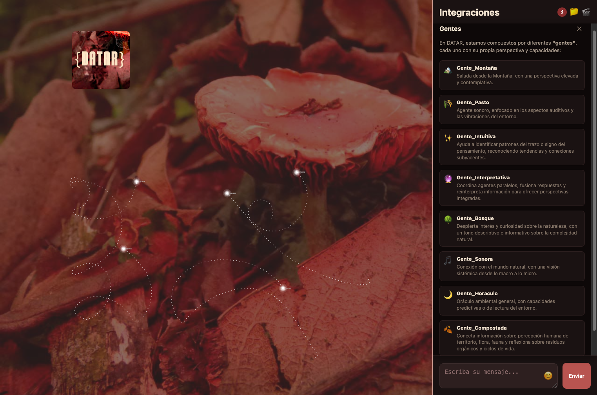

# {DATAR} Integraciones

## Laboratorio de experimentación con datos ambientales basado en la orquestación de agentes autónomos.

Franja Plataforma Satélite de [Plataforma Bogotá](https://plataformabogota.gov.co/).

Laboratorio a cargo de:
[MangleRojo ORG](https://manglerojo.org) y [LaBosquescuela UBA](https://labosquescuela.org)

[Ver Prototipo](https://datar-integraciones-web-app-dd3vrcpotq-rj.a.run.app/)

Prototipo desarrollado con **Google ADK (Agent Development Kit)** https://google.github.io/adk-docs/ que orquesta múltiples sub-agentes especializados. Cada agente está diseñado para facilitar diferentes formas de interacción y exploración del entorno natural, promoviendo una relación más sensible y relacional con los ecosistemas.

## Arquitectura

El prototipo está organizado en una arquitectura jerárquica:

- **Agente Raíz (Gente_Raiz)**: Orquestador principal que gestiona y enruta las interacciones hacia los sub-agentes especializados.
- **Sub-agentes**: Agentes especializados que ofrecen diferentes perspectivas y herramientas para explorar el entorno.

## Sub-agentes Disponibles

### Gente_Montaña
Agente que saluda desde la perspectiva de la montaña.

### Gente_Pasto
Exploración de experiencias relacionadas con el pasto y la vegetación.

### Gente_Intuitiva
Generación de visualizaciones y artefactos visuales basados en percepciones intuitivas del entorno.

### Gente_Interpretativa
Sistema de interpretación y re-interpretación del entorno usando emojis y texto, con múltiples capas de agentes que procesan y fusionan perspectivas.

### Gente_Bosque
Agente especializado en el bosque de la Sede Macarena que guía observaciones sensoriales del entorno, e infiere especies presentes basándose en condiciones ambientales.

### Gente_Sonora
Exploración de ambientes sonoros y experiencias auditivas, creando un puente entre múltiples perspectivas sonoras del entorno natural.

### Gente_Horaculo
Agente especializado en aspectos temporales y horarios.

### Gente_Compostada
Agente relacionado con procesos de compostaje y ciclos naturales.

## Configuración

### Modelo LLM

Por defecto, el prototipo utiliza el modelo `minimax-m2` a través de OpenRouter.

## Funcionalidades

- **Orquestación de agentes**: El agente raíz enruta automáticamente las interacciones al sub-agente más apropiado.
- **Generación de medios**: Los agentes pueden generar archivos de audio (`.wav`, `.m4a`, `.mp3`) e imágenes (`.png`) que se almacenan en Cloud Storage.
- **Herramientas especializadas**: Cada sub-agente tiene acceso a herramientas específicas (por ejemplo, `inferir_especies`, `crear_cartografía_emocional` en Gente_Bosque).
- **Integración con MCP**: Algunos agentes utilizan Model Context Protocol (MCP) para acceder a recursos externos.

## Uso

La aplicación se ejecuta como un servicio usando la clase `App` de Google ADK, compatible con:
- Google Cloud Run
- API Server local

El agente raíz ayuda a los usuarios a probar y explorar los diferentes sub-agentes disponibles en el prototipo.

---

Bogotá | Noviembre 2025
